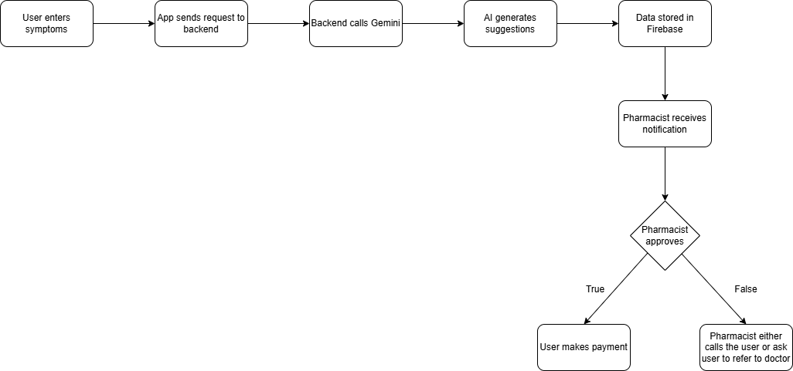

## MediAI
We are Team HelloHackers, a group of passionate developers dedicated to building innovative and user-centered healthcare solutions. Our goal with MediAI is to improve accessibility to over-the-counter (OTC) medications while ensuring safety, efficiency, and professional oversight through AI-assisted technology. 

### Team Introduction
**1. Jaslyn Chan Mun Kuan**  
- Group Leader and Backend Developer
- Integrates Gemini AI, implements Firebase backend and Cloud Functions

**2. Jennifer Ang Ching Wei**
- Frontend Developer
- Fluttur UI development and user experience design

**3. Goh Wan Qi**
- Frontend Developer
- Fluttur UI development and user experience design
- Handles integration of frontend and backend

**4. Stella Wong Kai Ning**
- Backend Developer
- Implement notification and call features
  
## Repository Overview
This repository contains the source code and documentation for MediAI, an AI-powered mobile application that enables users to purchase OTC medicines online safely and efficiently. The system combines AI symptom analysis with pharmacist verification, ensuring that users get reliable recommendations and responsible guidance when selecting medications.

## Table of contents
1. Project Overview
2. Key Features
3. Overview of Technologies Used
4. Implementation Details & Innovation
5. Challenges Faced
6. Installation & Setup
7. Future Roadmap

## 1. Project Overview
### Problem Statement
The rise in health-related issues has increased demand for medicines. In Malaysia, over-the-counter (OTC) drugs are widely available, often purchased without professional guidance. This can result in:  
- Incorrect drug selection
- Misuse or overuse of medications
- Potential health risks

Pharmacists may also face time constraints attending multiple customers, leading to delays in consultation and dispensing.

There is a need for a smarter, AI-assisted system to improve accessibility while ensuring safe and responsible medication use.

### Sustainable Development Goals (SDG) Alignment
MediAI aligns with the following Sustainable Development Goals:

**SDG 3 – Good Health and Well-being**  
MediAI promotes safe and effective medication use by incorporating pharmacist verification to reduce misuse of OTC drugs.

**SDG 9 – Industry, Innovation and Infrastructure**  
The integration of Artificial Intelligence (AI), specifically Gemini AI, demonstrates innovation in digital healthcare solutions.

**SDG 12 – Responsible Consumption and Production**  
By guiding users toward appropriate medication choices and involving pharmacists in the verification process, MediAI encourages responsible consumption of medicines.

### Solution Overview
MediAI is an AI-powered mobile application that:  
- Interacts with users to understand their symptoms
- Generates OTC medication recommendations using Gemini AI
- Sends recommendations to a pharmacist for verification before dispensing
- Allows users to securely purchase verified medicines online
This solution combines efficiency, safety, and innovation in healthcare access.

## 2. Key Features
**1. AI-Powered Symptom Analysis**  
Users describe their symptoms through an interactive chat interface powered by Gemini AI.

**2. Smart OTC Medication Recommendations**  
The system suggests suitable over-the-counter (OTC) medicines based on user input.

**3. Pharmacist Verification Workflow**  
All AI-generated recommendations are reviewed and approved by a pharmacist before final dispensing.

**4. Real-Time Case Notification**  
Pharmacists receive notifications when new cases require verification.

**5. Secure Conversation History (Firebase Integration)**  
User-AI conversations are securely stored for pharmacist review and record tracking.

**6. Online OTC Purchasing**  
Users can conveniently purchase verified OTC medicines directly within the application.

## 3. Overview of Technologies Used
### Google Technologies 
**1. Google Gemini (Generative AI Model)**  
Gemini AI is integrated into MediAI to analyze user-reported symptoms through natural language conversation. It generates intelligent OTC medication recommendations based on contextual understanding.

**2. Firebase**  
Firebase is used as the backend infrastructure of the application. It supports:

- Firestore database for storing user conversations
- Authentication (if implemented)
- Cloud Functions for server-side logic
- Real-time data synchronisation

**3. Firebase Cloud Functions**  
Used to handle secure backend logic, API calls to Gemini AI, and pharmacist notification workflows.

**4. Flutter**  
Used to develop the cross-platform mobile application interface. Flutter enables smooth UI rendering and seamless communication with the backend services.

### Other Supporting Tools / Libraries
**1. Node.js**  
Used for backend development and server-side logic.

**2. Express.js**  
Provides routing and API endpoint handling for communication between the mobile app and backend.

**3. CORS Middleware**  
Enables secure cross-origin communication between frontend and backend.

**4. Android Studio**  
Used to develop and test the mobile application interface.

## 4. Implementation Details & Innovation
### System Architecture 

### Workflow


## 5. Challenges Faced
During development, our team encountered several technical challenges while building MediAI:  

**1. Integrating Frontend and Backend**  
Merging Flutter frontend with Firebase backend and Cloud Functions required careful handling of API calls and data flow.

**2. AI API Limitations on Android Studio**  
Initially, calls to Gemini AI did not work directly through Android Studio, which required switching to Flutter for proper integration.

**3. UI Responsiveness**  
Making the chat interface smooth and intuitive across different devices and screen sizes.

**4. AI Response Accuracy**  
Initially, the AI often provided irrelevant or mismatched responses, which required debugging and fine-tuning how input is sent to the API.

## 6. Installation & Setup
This guide walks you through setting up and running the MediAI app locally.  

**Step 1: Install Prerequisites**
1. **Download VS Code**: With the Visual Studio Code IDE, you can simply copy the git repository URL, clone it to your local device, and run the application locally.
2. **Install Flutter SDK** Follow the [official Flutter installation guide](https://docs.flutter.dev/install/custom). We recommend using the **Install with VS Code** method.
After installation, verify setup:
```bash
flutter doctor
```
3. **Install Flutter and Dart extensions**: [Install from the Visual Studio Code Marketplace](https://marketplace.visualstudio.com/items?itemName=Dart-Code.flutter) or by [searching within VS Code](https://code.visualstudio.com/docs/editor/extension-gallery#_search-for-an-extension). The Dart extension will be installed automatically, if not already installed.
Please see the [Flutter documentation for using VS Code](https://docs.flutter.dev/install/with-vs-code).

**Step 2: Clone Repository**:
1. **Clone the Repository**: 
    - Click on the "Code" button
    - Select the Visual Studio Code, HTTPS option under the "Open with" tab
    - Select the Folder you wish to store the repository under.

**Step 2: Installation**
1. **Install Node.js**: Navigate to [Node installation guide](https://nodejs.org/en/download) and install the latest version of Node.js
2. **Install FlutterFire CLI**: To install, run the following command:
```bash
dart pub global activate flutterfire_cli
```
3. FlutterFire CLI requires the Firebase CLI (`firebase-tools`) to be installed on your local machine, [follow these instructions](https://firebase.google.com/docs/cli) for installation.
If you're running on a windows machine, we highly recommend you install via npm (i.e. `npm install -g firebase-tools`). The standalone
`firebase-tools` version can cause problems which you can read about [here](https://github.com/invertase/flutterfire_cli/issues/55#issuecomment-1316201478).
4. **Install Dependencies**: In VS Code, open the terminal, and insert the command below, then press Enter:
```bash
cd functions
npm install
```

**Step 3: Running the application**
1. **Fetch Dependencies**: Run to update `pubspec.yaml` and download the package
```bash
flutter pub get
```
2. **Initialise Firebase**: If not already done, configure your project using the FlutterFire CLI:
```bash
flutterfire configure
```
3. **Run the Application**: Start emulator or connect device, then run
```bash
flutter run
```

## 7. Future Roadmap
**Phase 1: Enhanced User Interaction**  
- Add voice-based user input
- Integrate AI transcription for speech-to-text conversion
- Implement structured symptom extraction to improve AI analysis

**Phase 2: Personalised Healthcare Assistance**  
- Personalise AI dosage recommendations and guidance based on user history
- Implement proactive AI follow-ups and medication reminders
- Support multi-language AI interactions to reach a wider user base

**Phase 3: Advanced System Insights & Operations**  
- Provide inventory and availability visibility for pharmacies
- Implement analytics dashboard for usage and trends
- Ensure multi-region compliance for regulatory and safety standards
